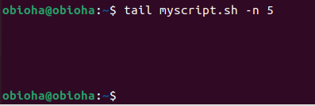

## FILE MANIPULATION

1. sudo command

The sudo command is used whenever we want administrative access to run a command for example. We can
also add flags such as -k, -g, -h.

```
sudo apt upgrade
```


2. pwd command

This means present working directory. it gives the present directory of where we are working.

```
pwd
```


3. cd command

This command helps to switch to a directory. We must put in the command then the directory we want
to switch to.

```
cd /home/ubuntu/myFolder
```

we can also use the cd command to move forward or backward in a directory

```
cd ..
```

Moves one directory up

```
cd -
```

Moves to our previous directory.


4. ls command

The ls command list out files and folders within a system. It can also be run with flags such as -R
to list all the files in a subdirectory, -a to show hidden files, -lh, show file sizes and so on.

```
ls -lh
```


5. cat command

This gives or shows content of a file.

```
cat sqlite_commands.sh
```


6. cp command

We use the cp command to copy files or directories and their content. As shown in the example below,
to copy a file from one directory to another we have to state file name and to.

```
cp myscript.sh /home/obioha/myFolder
```


To copy an entire directory, we can pass in the flag -R before typing the source directory followed
by the destination.

```
cp -R /home/username/Documents /home/username/Documents_backup
```

7. mv command

This command is to move and rename files in linux

```
mv testFile /home/obioha/myFolder
```


we can also use mv to rename files

```
mv testFile myFile
```


8. mkdir command

This command is used to create directories. The is command also has it own flags like -p to create a
directory between two exiting folders, -m example -m777 set a permission on created folders, -v
prints a message for each created directory.

```
mkdir myFolder
```


9. rmdir command

To delete an empty directory we use this command wth sudo privileges.

```
rmdir deletefolder
```


10. rm command

This is used to delete file within a directory. We can use the sudo privileges or make sure the user
performing this action has the write permission. we can also add flags such as -r to remove files
and directory recursively. -f allows the system to remove such files without permission.

```
rm new-2.txt
```


11. touch command

The touch command is used to create a file.

```
touch newFile.txt
```


12. locate command

This command finds a file in the database. as others, it has flags of it own like -i to turn off
case sensitivity. To look for content that contains two or more words we use the asterisk \*

```
locate -i EBuka*Hello
```


13. find command

This is used to find files within a specific directory

```
find /home/obioha -name myscript.sh
```


14. grep command

grep from the word regular expression let you find a word by searching through all the text in a
specific file.

```
grep EBuka myscript.sh
```


15. df command

we use the df command to report system disk space usage. we use the flag -h to show the output in
human readable format in modification date.

```df -h

```


16. du command

This command tells us which file/folder use up more space on our storage. Unit is in kb

```
du /home/obioha/myFolder
```


17. head command

The head command allows you to view the first ten lines of a file. You can change the number of
lines shown using a flag -n.

```
head myscript.sh -n 5
```


18. tail

The tail command is the opposite of the head command. displays the last 10 lines of a file.

```
tail myscript.sh -n 5
```



19. diff command

This compares the difference between two files line by line. It will display the part that do not
match.

```
diff text1.txt text2.txt
```


20. tar command

the Tar command archives multiple files into TAR file. Its similar to zip.

```
tar -cvf newarchive.tar /home/obioha
```

comes with its flags such as -x extracts a file, -t list the content of a file, -u archives and adds
to an existing archive file.

## FILE PERMISSION AND OWNERSHIP

21. chmod command

This command modifies a file or folder read write and execute permissions. In linux each file is
associated with three user classes, member, group and others.

```
chmod 777 text1.txt -v
```


22. chown command

This command let you change the ownership of a file or directory to a specific username.

```
chown linuxuser2 text1.txt
```

23. jobs command

The job command displays all the running processes and their status.

```
jobs [options] jobId
```

24. Kill Command

We use the kill command to terminate an unresponsive program. We can use `ps ux` to know the PID.

```
kill [signal option] pid
```

25. ping command

this command is one of the basics of linux and its also used in windows CLI. Used to check if a
network is reachable.

```
ping google.com
```

26. wget command

This command help download items from the internet without interrupting other processes. It works in
the back ground.

```
wget https://wordpress.org/latest.zip
```

27. uname command

The unix name command (uname) prints information about your linux system and hardware.

```
uname -a
```


28. top command

this displays all the running processes and a dynamic real time view of the current system. It also
help identify and terminate a process that use up too many resources.

```
top
```

29. history command

The history command list out previously executed commands allowing you to use them without
re-entering.

```
history
```

30. man command

this command provides a user manual of any command or utility you can run in the terminal.

```
man
```

If you want to list manual of the ls command you do

```
man ls
```

31. echo command

This is a built in utility that displays a line of text or string using the standard output. This
has its own flag such as -n, display output without trailing new line, etc.

```
echo [option][string]
```

32. zip and unzip commands

We use the zip command to compress your files into a ZIP fil, a commonly used format on linux. Used
for files and directory.

```
zip [option] zipfile file1 file2...
```

```
zip archive.zip note.txt
```

To archive a note.txt file.

```
unzip archive.zip
```

33. hostname command

This displays the system hostname. -i displays the hostname ip address.

```
hostname -i
```

34. useradd, userdel commands

useradd is used to create a new account, while passwd allows you to add a password to that user.
Only with the sudo can this be run.

to create a user

```
useradd username
```

to set password

```
passwd user_password
```

To delete a user we run

```
userdel username
```

35. apt-get command

A command line too that helps to handle packages in linux. Running the apt-get command requires you
to use sudo or root privileges.

```
apt-get [options] (command)
```

36. nano, vi, jed commands

This command line tools helps to edit and manage files. nano and vi comes with the operating system
but jeb has to be installed. vi is my favorite.

```
vi myscritpt.sh
```

37. alias, unalias commands

Alias is a cool command that lets you create a shortcut with the same functionality as a command,
file name or text. it instruct the shell to replace one string with another.

```
alias k='Kill'
```

To undo this we use unalias.

```
unalias [alias name]
```

38. su command

The switch user allows you to run a command as a different user. It runs through root privileges
when executed without options or arguments.

```
su [options] [username [argument]]
```

39. htop command

The htop command monitors system resources and server processes in real time. Its can be installed
by running the `apt install htop `

```
htop
```

40. ps command

The process status produces snapshots of all running processes in your system.

```
ps
```


